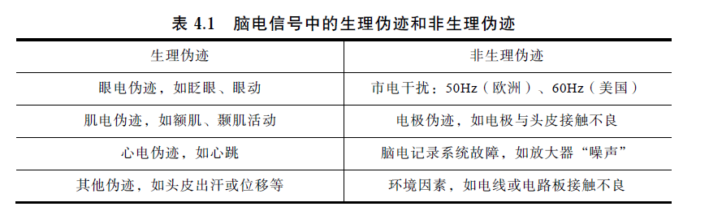

## 伪迹

## 导联方法

国际 10-20 系统是一个国际公认的关于电极位置和电极命名的系统

规范了电极位置和命名后，电极之间的电势差构成了通道，不同通道的组合即称为导联。有两种主要的导联类型：双极导联和参考导联

双极导联：通道按横向或纵向呈链状排列，即第一个通道中的第二根导线是第二个通道的第一根导线，以此类推。在此种导联方式下，外部的噪声很容易被消除，因为它记录的是相邻电极之间的电势差， 因此选择性地放大了局部电位。

参考导联：通道则代表有效电极与参考电极的电位差，这种方式既可以检测到参考电极与较近的电极点之间的电位差，也可
以检测到其与较远的电极点之间的电势差，但容易受到外界噪声的影响。

与双极导联相比，参考导联记录到的电势差更接近绝对电势差。

## 滤波

低通，高通，带通，凹陷滤波器四种

通常将滤波作为预处理的第一步，特别是在分段之前，否则会在分段的边界引入滤波伪迹（总之就是滤波过程中引入的伪波形）。

## 重参考

