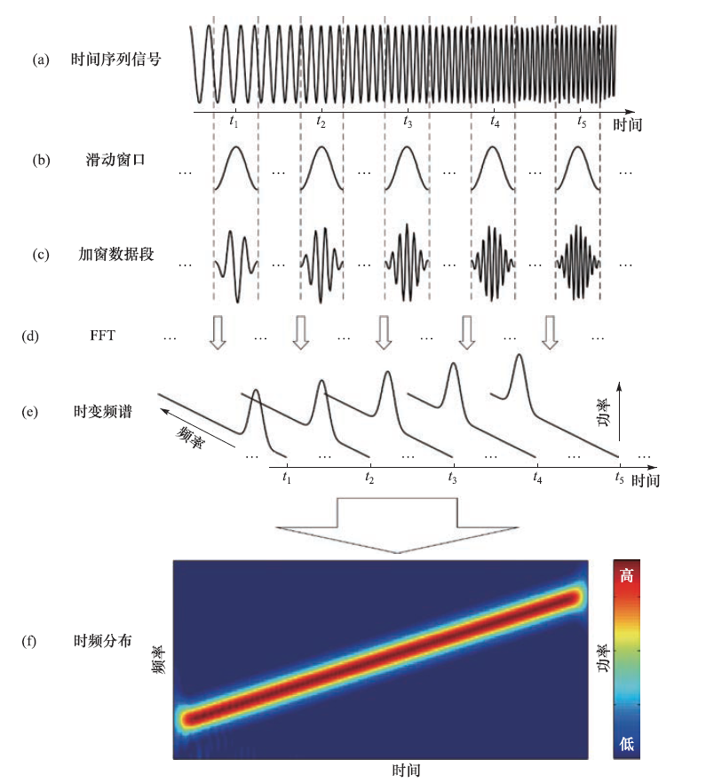
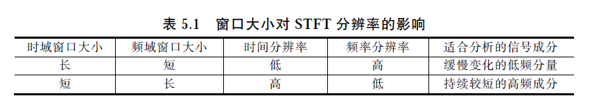
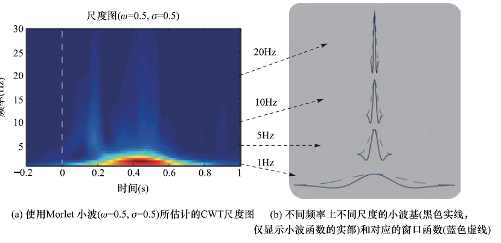

## 傅里叶变换

比如说现在有这样一个信号，他实际上是三种波叠加而成的

然而，通过这个时域图，很难定量地读出这三种波的周期情况

因此，通过傅里叶变换，可以获得一个频域图，定量地获取指定频率的波的参数情况

### 傅里叶变换的公式

公式如下

总之可以知道，给一个连续信号（已知任意时刻的波的幅度），给定一个频率（由于奈奎斯特频率，这个频率必须小于信号采样率的一半，否则会出现混叠）

### 混叠

## 频谱估计

总而言之，通过傅里叶变换，可以从采集的脑电信号中，提取出指定频率的信号的参数

此外，现实中使用脑电设备采集的脑电信号需要经过模拟-数字转换器的处理，也就是需要使用离散傅里叶变换，大致逻辑相同的

然后呢`X(k)`包含的信息有：

总之就可以根据`X(k)`以及其他信息计算诸如功率谱之类的东西了

### 周期图

这个绝对值里面的内容就是上面的`X(k)`，总之就是计算下功率

通过数学手段可以知道，周期图的方差就是周期图的平方值，这意味着无法通过使用更多的数据采样来降低周期图的方差。因此，周期图通常表现出非常高的方差，这使得信号频谱峰值难以被清楚观察和精确定位。对于需要平滑频谱估计的脑电应用而言，周期图并不适合。

### Welch 法

总之就是能够获得方差更小的周期图，Welch 法得到的频谱估计的方差是周期图频谱估计方差的1/k。

### 多窗口法

嗯自己看书去

### 自回归模型

总之就是一个自回归的方法，`x[n]`的数值依赖于在它之前的信号数据`x[n-1]`等，同时`ap`也是依赖于`x[n]`计算出来的

此外，显然不同的模型阶数P 会极大地影响AR 频谱估计的结果，如何确定一个好的`P`可以回去看书

### 比较

自回归模型是参数方法，其他的都是非参数方法

由于脑电信号通常具有**宽且平滑的频谱，包含大量噪声，并且数据量足够**（例如，时长1s 且采样率为1000Hz 的脑电数据就有1000 个采样点），因此非参数方法是比较适合进行脑电分析的。当然，如果**预先指定的模型准确**，参数方法，如基于自回归模型的频谱估计，也可以获得满意的结果。

### 频谱特征提取

最常见的脑电频谱特征是特定频段内的频谱功率

另外一类重要的脑电频谱特征是频谱峰值的频率、幅度和带宽

## 时频估计

问题：频谱估计中，假设一段脑电信号的频谱是固定的，不随时间而改变，然而脑电频谱是可以通过实验条件或心理状态进行动态调制的，因此脑电频谱的时变特征传递着重要的信息，因此需要引入时间

### 短时傅里叶变换

滑动窗口法假设非平稳信号可以被分成一系列短数据段，每个短数据段内部都是平稳的。

①选择一个有限长度的窗口函数；

②从信号起始点开始，将窗口放置在信号上；

③用窗口将信号分段加权，产生一系列短数据段；

④计算加窗短数据段的频谱；

⑤沿着时间轴滑动窗口；

⑥回到第③步，
直到窗口到达信号最末端。

先选择一个对称、钟形和有限长度的窗口，再将窗口函数与信号相乘以生成加窗短数据段，再使用频谱估计方法估计加窗数据段
的频谱，也就是知道了每个时间段内的频谱了（频率-功率），然后就形成了(f)图。

#### 窗口大小的影响

显然时域窗口小则时间分辨率就高

那时域窗口小为什么会导致频率分辨率低呢？可以这么理解，时间很短（0.01s），此时因为时间很短，波的变化也很少，所以很难分辨出499HZ和500HZ的波，因为在这个很短的窗口中他们基本上是一样的

### 连续小波变换

总之和短时傅里叶变换差不多，但是针对不同的频率使用了不同的窗口函数（前面那个例子使用的是不变、对称、钟形和有限长度的窗口）

## 事件相关同步化/去同步化

